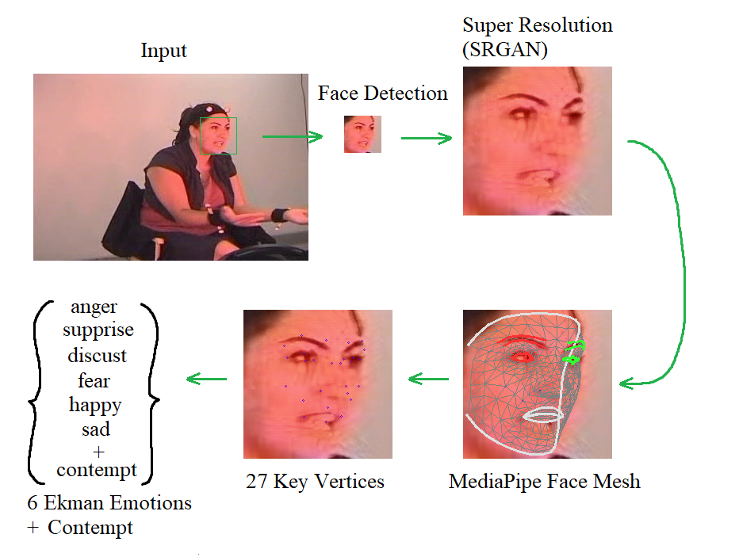

## Emotion Detection with Super Resolution
Emotion detection by using MediaPipe Face Mesh indexes and KNN classifier for identifying 6+1 Ekman emotions.
(anger, discust, fear, happy, sad, supprise + contempt)

Detailed project description can be found:
[HERE] (https://github.com/Kerachi/presentations/topic_presentation.pdf)

<a href="https://github.com/Kerachi/presentations/showcase.png">

	

</a>

<a href="https://github.com/Kerachi/presentations/showcase2.png">

	

</a>

#### Configuration
    For an image+emotion label dataset:
        In train.py set the following config variables:
            img_base_path = 'datasets/CK+/' <-- path to your dataset
            img_path = img_base_path + 'cohn-kanade-images/*/*/*.png' <-- path to the images inside your dataset
            emotion_path = img_base_path + 'Emotion/*/*/*.txt' <-- path to the emotion labels inside your dataset
    
    In the train.py you should change these config variables according your needs
    saveImage = True
        To save upscaled or not upscaled images into files
            face cropped image + fc+image + image+facemash + (image+fc+27 keypoints)
    upscale = True
        To upscale the face 
    saveLandmarks = False
        To save 27 important landmarks into a file (for each image)
    trainKNN = False
        To train the KNN classifier
            should be set to True only after we have saved all landmark (dataset_results/landmarks.txt by default)
    detectEmotion = False
        To save detected emotions into a file (dataset_results/predictedEmotions.txt by default)
            should be set to True only after we have trained the KNN classifier with the landmarks
    customImage = True
        To use the application for a single custom image
        

#### Usage
    Use the train.py file the following way to detect emotions by running train.py and reconfigure it:
        └──1. saveLandmarks (with sr or not)
        └──2. trainKNN      (with sr or not)
        └──3. detectEmotion (with sr or not)
    
    Run:
        python3 train.py <-- To run the application
        
        Tool(s):
        python3 video_to_images.py
            To convert a video to series of images (you should change/configure this file according your needs)

#### Requirements
    └──MediaPipe
    └──OS: Ubuntu 20.04.4 LTS
    └──Nvidia Graphics card(s) (optional, for faster SR)
    
    The project was tested with the following hardware(with CPU only and CPU+Graphics Card):
        CPU: AMD Ryzen 5 2600
        GPU: Nvidia GeForce RTX 2060
        RAM: 16 GB

Used sr repository:
[SRGAN] (https://github.com/tensorlayer/srgan)

